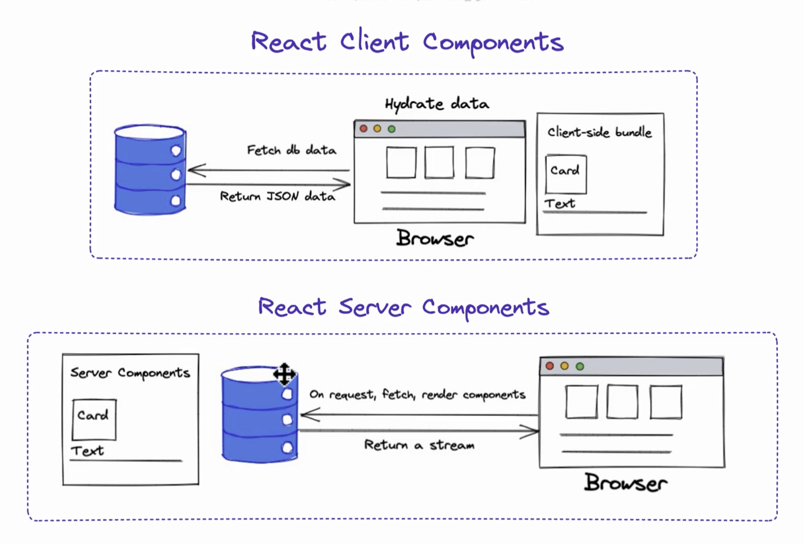

This is a [Next.js](https://nextjs.org) project bootstrapped with [`create-next-app`](https://nextjs.org/docs/app/api-reference/cli/create-next-app).

## Getting Started

First, run the development server:

```bash
npm run dev
# or
yarn dev
# or
pnpm dev
# or
bun dev
```

Open [http://localhost:3000](http://localhost:3000) with your browser to see the result.

You can start editing the page by modifying `app/page.tsx`. The page auto-updates as you edit the file.

This project uses [`next/font`](https://nextjs.org/docs/app/building-your-application/optimizing/fonts) to automatically optimize and load [Geist](https://vercel.com/font), a new font family for Vercel.

## Learn More

To learn more about Next.js, take a look at the following resources:

- [Next.js Documentation](https://nextjs.org/docs) - learn about Next.js features and API.
- [Learn Next.js](https://nextjs.org/learn) - an interactive Next.js tutorial.

You can check out [the Next.js GitHub repository](https://github.com/vercel/next.js) - your feedback and contributions are welcome!

## Deploy on Vercel

The easiest way to deploy your Next.js app is to use the [Vercel Platform](https://vercel.com/new?utm_medium=default-template&filter=next.js&utm_source=create-next-app&utm_campaign=create-next-app-readme) from the creators of Next.js.

Check out our [Next.js deployment documentation](https://nextjs.org/docs/app/building-your-application/deploying) for more details.

## NextJS File Structure


## Custom TailwindCSS

```css
@import "tailwindcss";

@theme {
  --color-purple-951: rgba(
    79,
    70,
    229,
    1
  ); /* Use as className='bg-purple-951' */
  --color-gray-951: hsla(0, 0%, 100%, 0.4);
  --color-gray-952: #373b64;
  --background-image-gradient: url("static/background.png");
  --font-sans: [ "--font-ibm-plex-sans"]; /* Use as className='font-sans' */
  --font-inter: [ "--font-inter"];
}

body {
  @apply bg-gradient /* Uses above background-image gradient */;
}
```

## Next Fonts

Automatically self-host Google fonts with [Next-Fonts](https://nextjs.org/docs/app/building-your-application/optimizing/fonts#google-fonts) to optimally load web fonts with zero `layout shift`.

```js
import { IBM_Plex_Sans } from "next/font/google";

const ibmPlexSans = IBM_Plex_Sans({
  subsets: ["latin"],
  display: "swap",
  weight: ["500", "600", "700"],
});

export default function RootLayout({
  children,
}: Readonly<{
  children: React.ReactNode,
}>) {
  return (
    <html lang="en">
      <body className={`${ibmPlexSans.className} antialiased`}>{children}</body>
    </html>
  );
}
```

### Apply Multiple Fonts

```js
import { IBM_Plex_Sans, Inter } from "next/font/google";

const ibmPlexSans = IBM_Plex_Sans({
  display: "swap",
  subsets: ["latin"],
  weight: ["500", "600", "700"],
  variable: "--font-ibm-plex-sans",
});

const inter = Inter({
  display: "swap",
  subsets: ["latin"],
  variable: "--font-inter",
});

export default function RootLayout({
  children,
}: Readonly<{
  children: React.ReactNode,
}>) {
  return (
    <html lang="en">
      <body
        className={`${ibmPlexSans.variable} ${inter.variable} antialiased`}
      ></body>
    </html>
  );
}
```

## Metadata API

Covers all [metadata](https://nextjs.org/docs/app/building-your-application/optimizing/metadata) fields necessary for effective search engine optimization

```js
import type { Metadata } from "next";

export const metadata: Metadata = {
  metadataBase: new URL("https://example.com"),
  title: { default: "My Site", template: "%s | My Site" },
  description: "Welcome to My Site",
  alternates: {
    canonical: "https://example.com",
    languages: {
      "en-US": "https://example.com/en-US",
      "de-DE": "https://example.com/de-DE",
    },
  },
  openGraph: {
    title: "My Site",
    description: "Welcome to My Site",
    url: "https://example.com",
    siteName: "My Site",
    images: [{ url: "https://example.com/og.png" }],
  },
};
```

## Server Components

Like React `Client` components but instead fetched and rendered at the server. [Server components](https://nextjs.org/docs/app/building-your-application/rendering/server-components) are built by the server and are sent as streams of text data to reduce large dependencies and client-side javascript, keep sensitive data on the server (keys, api tokens). Client components are still needed to add interactivity, event listeners, use state and lifecycle effects, use browser-only APIs, custom hooks that depend on state, etc.



## Routing

Next.js uses two different [routers](https://nextjs.org/docs#app-router-vs-pages-router), `App Router` which is filebased routing off the `app` directory and `Page Router`. To create a page using the App router, add a `page` file inside the `app` directory and default export a `React` component. To create new routes, nest another `page` file inside a child directory, e.g. `app/settings/page.tsx` and the App router will automatically register the new route. Register a `dynamic` route similarly to the nested route but includes a `[]` around the directory name, e.g. `app/coffee-store/[id]`. Define a `catch-all` route using `...` in the directory name, e.g. `app/coffee-store/[...id]`

### Dynamic Routing Example

```js
import React from "react";

export default function Page(props: { params: { id: string } }) {
  const {
    params: { id },
  } = props;
  console.log(`Store ID: ${id}`);

  return <div>Coffee Store Page: {id}</div>;
}
```

### App Router Filebased Structure


## Search Engine Optimization (SEO)


Basic factors contributing to SEO score:

- Page speed
- Mobile-friendliness
- Secure and accessible website
- Quality of content
- HTML header metadata
- HTML content
- Image alt tags
- Click through rate
- Bounce back
- Dwell time

### Server Rendering

The process of pre-rendering a page is called [static generation](https://nextjs.org/docs/app/building-your-application/rendering/static-generation), where a static page is tranformed into a dynamic page is called [hydration](https://nextjs.org/docs/app/building-your-application/rendering/hydration).

Server rendering enables users and Ranking bots to request and receive a fully rendered page even before javascript has loaded or executed any client-side code. This is important for SEO because search engines can crawl and index the content of the page, improving its visibility in search results. Server rendering also improves performance by reducing the time it takes for a page to load and display content to users.

### Data Fetching

1. `Static site generation` (SSG) - pre-rendering a page at build time

- Good for pages that don't change often, like a blog or documentation site

2. `Server-side rendering` (SSR) - pre-rendering a page at request time

- Good for pages that need to be updated frequently, like a news site or e-commerce store (dynamic data)

3. `Client-side rendering` (CSR) - pre-rendering a page at runtime

- Good for pages that need to be interactive, like a dashboard or web app
- Fetch data on the client-side using `useSWR` (stale-while-revalidate) hooks

4. `Incremental static regeneration` (ISR) - pre-rendering a page at build time and revalidating it at request time

- Good for pages that need to be updated frequently but don't need to be re-rendered every time
- Deliver static content while checking for updates in the background and re-render page at specified intervals

### Data Caching

1. `Request Memoization` - Caching the result of a function call based on its input arguments
2. `Data Cache` - Stores data results across user requests and deployments
3. `Full Route Cache` - Caching the result of a full route rendering including HTML and React server components.
4. `Router Cache` - Caching the result of a router operation storing React server component payloads in memory across user sessions

### Fetching Data Examples

Each cache type can be implemented using the `cache` option in the `fetch` function. The default cache type is `force-cache`, which means that the data will be cached for the duration of the request and will not be revalidated until the cache expires.

```js
// Static site generation
const res = await fetch("https://api.disneyapi.dev/api/v1/characters", {
  cache: "force-cache", // Default cache type
});

// Server-side rendering
const res = await fetch("https://api.disneyapi.dev/api/v1/characters", {
  cache: "no-store",
});

// Incemental static regeneration
const res = await fetch("https://api.disneyapi.dev/api/v1/characters", {
  next: { revalidate: 3600 }, // Revalidate every hour
});
```
